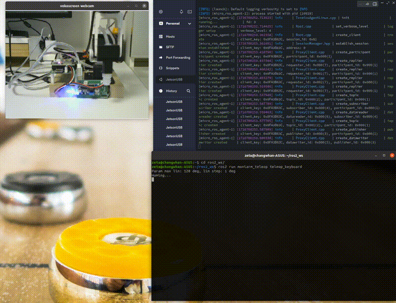
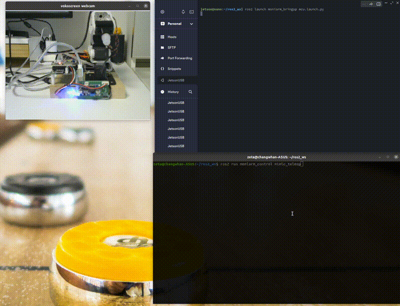
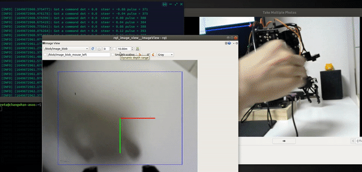

# Moniarm: 4DoF + 1 AirPump/Gripper DIY Arm
**This project is about ROS2 Package for Robot Arm with DIY robot**    
Robot 3D model, BOM: Byungki  
Circuit: Byungki, ZETA7  
PCB layout: Byungki  
Aruduino/ESP32 scketch: ZETA7  
ROS code: ZETA7, JH Moon, MS Song  

## Test System information

**Jetson Nano 4GB/Laptop + ESP32 + Herkulex DRS-0101 Motor**    
* Ubuntu 20.04
* ROS Galactic

## Packages with Brief Explanation

```
├── moniarm_bringup       => robot bringup, start micro ros agent
├── moniarm_control       => Control DIY Robot Arm
├── moniarm_cv            => Computer Vision Package
├── moniarm_description   => Show robot model
├── moniarm_interfaces    => Custom message and serivce
├── moniarm_ml            => AI/ML
├── moniarm_teleop        => Teleoperation by human
├── arduino               => micro ros on ESP32, udev rules, motor tester
(...)
├── script                => configure motor, camera, etc
├── Images                => Image for this README
├── Doc                   => command list
├── LICENSE
├── README.md
```

# Especially Thanks
Road-Balance: https://github.com/Road-Balance/donkey_ros  
Ar-Ray: https://github.com/Ar-Ray-code/darknet_ros_fp16  
OMO R1 Mini: https://github.com/omorobot/omo_r1mini-foxy  
Other Open Source sites  

### Moniarm, it uses ESP32 NodeMcu
```
create_udev_rules_esp32snode.sh, delete_udev_rules_esp32snode.sh, esp32sNodemcu.rules:
  udev rule for ESP32
arduino_libraries:
  script for building micro_ros_arduino
motorChecker/motorChecker.ino:
  Check Herkulex smart motor
humanGuide/humanGuide.ino:
  read angles for human guide
motorEncExtraRos/motorEncExtraRos.ino
  Please burn this sketch for Robot ARM
```

There's Notion page, please visit here to get latest information   
But, It's written in Korean. Anyway, Here's the link   
https://zeta7.notion.site/MoniArm-f29941635dfb4ff29d528842d2d5c38e?pvs=4  

## Installation
Please download Ubuntu image from below location   
https://drive.google.com/file/d/1Jhr4SIeKLocHbJyeximI-j3mksZNgxN3/view?usp=drive_link   

```bash
id: jetson
passwd: jetson
```

### Clone source

```bash
  cd {$workspace_path}/src/
  git clone -b $ROS_DISTRO https://github.com/micro-ROS/micro_ros_setup.git
  git clone https://github.com/orocapangyo/moniarm.git
  git clone --recursive https://github.com/zeta0707/darknet_ros_fp16.git
  darknet_ros_fp16/darknet_ros/rm_darknet_CMakeLists.sh
```

### Install dependency packages

Following additional packages may be reuqired to be installed.  
```bash
sudo apt update
pip3 install vcstool
sudo apt install -y joystick ros-galactic-ackermann-msgs ros-galactic-joy* \
 ros-galactic-image-pipeline ros-galactic-ros2-control ros-galactic-ros2-controllers \
 ros-galactic-hardware-interface ros-galactic-joint-state-publisher*
```

### Build ROS2 source
- To give authority for driver access to ESP32  
```bash
sudo usermod -aG dialout jetson

cd {$workspace_path}/src/moniarm/arduino
./create_udev_rules_esp32snode.sh
```
- Configure environment
```bash
cd ~/ros2_ws/src/moniarm/script
./selDomain.sh ROS_DOMAIN_ID
./camSelect.sh PORT_NUM
./setMotorid.sh M0_ID M1_ID M2_ID M3_ID
```
- To build
```bash
  cd {$workspace_path}
  colcon build --symlink-install
```

- To enable the built source into ROS2 environment
```bash
  cd {$workspace_path}
  ./install/setup.bash
```

### **Verify USB camera**  
Control Robot Arm with gamepad/jostick  
<p align="center">
    
</p>

```bash
cd {$workspace_path}
# jetson , terminal #1
$ ros2 launch moniarm_cv usbcam.launch.py

$ ros2 run rqt_image_view rqt_image_view
# or
$ ros2 run image_view image_view --ros-args --remap /image:=/image_raw
```

### **Play with joystick**  
Control Robot Arm with gamepad/jostick  
<p align="center">
    
</p>

```bash
cd {$workspace_path}
# jetson , terminal #1
$ ros2 launch monicar2_bringup mcu.launch.py
#jetson or pc, terminal #2
$ ros2 launch monicar2_teleop teleop_joy.launch.py

Left Stick left/right:  Base(M0), left/light
Left Stick up/down:     shoulder(M1) move
Right Stick up/down:    Elbow(M2) move
Right Stick left/right: Wrist(M3) move

'X' : gripper open/close
'A' : Change led
'B' : Play buzzer song
'Y' : Play OLED animation
```

### **Play with keyboard**  
Control Robot Arm with keyboard  
<p align="center">
    
</p>

```bash
cd {$workspace_path}
# jetson , terminal #1
$ ros2 launch moniarm_bringup mcu.launch.py
#jetson or pc, terminal #2
$ ros2 run moniarm_teleop teleop_keyboard

a/d : base(M0), left/light
w/x : shoulder(M1) move
q/z : Elbow(M2) move
e/c : Wrist(M3) move

l: Change led
u: play buzzer song
o: OLED animation
i: Motor mode set/init
```

### **Mimic teleop**  
Autonomous move for mimicing human operation
<p align="center">
    
</p>

```bash
cd {$workspace_path}
# jetson , terminal #1
$ ros2 launch moniarm_bringup mcu.launch.py
#jetson or pc, terminal #2
$ ros2 run moniarm_control mimic_teleop
```

### **Blob pick and plance**  
Find the any color box of the Jetson Nano on the screen. then pick it then place  
<p align="center">
    
</p>

```bash
$ ros2 launch moniarm_control blob_all.launch.py
```

### **Yolo pick and place**  
Find the object of the Jetson Nano on the screen, pick it then place  
<p align="center">
    
</p>

```bash
#terminal #1, #object detect using Yolo_v4
$ ros2 launch darknet_ros yolov4-moniarm.launch.py

#terminal #2,camera publish, object -> start or stop
$ ros2 launch moniarm_control yolo_all.launch.py
```

### **state publisher -> robot**  
joint_states publisher -> Move robot arm accordingly, TBD  
<p align="center">
    
</p>

```bash
#terminal #1, Jetson
$ ros2 launch moniarm_bringup mcu.launch.py
#terminal #2, Laptop
$ ros2 launch moniarm_control state_all.launch.py
```

### **Blob pick and place with Deep Learning**
neural network -> Move robot arm accordingly
<p align="center">
    
</p>

```bash
#terminal #1, Jetson
$ ros2 launch moniarm_control blob_getdata.launch.py
#terminal #2, Laptop
$ ros2 launch moniarm_ml blob_nn.launch.py
```

### **Yolo pick and place with Deep Learning**
neural network -> Move robot arm accordingly
<p align="center">
    
</p>

```bash
#terminal #1, Jetson
$ ros2 launch moniarm_control yolo_getdata.launch.py 
#terminal #2, Laptop
$ ros2 launch moniarm_ml yolo_nn.launch.py
```
