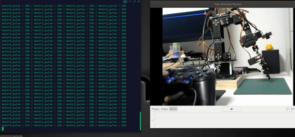
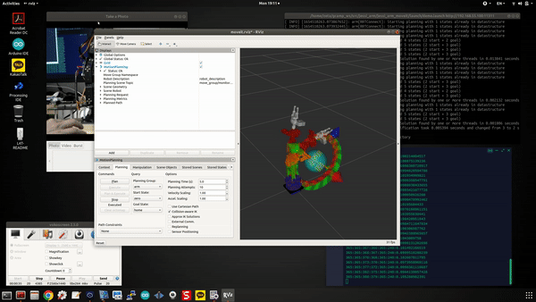
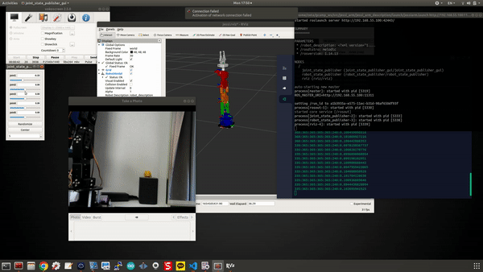

# Moniarm: ROS2 Robot 3DoF Arm  
**This project is about ROS Package for Robot Arm with DIY robot**    
Robot 3D model, BOM: Byungki  
Circuit: Byungki, ZETA7  
PCB layout: Byungki  
Aruduino/ESP32 scketch: ZETA7  
ROS code: ZETA7  

## Tested System information

**Jetson Nano 4GB/2GB + ESP32 + Herkulex Smart Motor**    
* Ubuntu 20.04
* ROS Galactic

## Packages with Brief Explanation

```
├── moniarm_bringup       => robot bringup, start uROS
├── moniarm_control       => Control DIY Robot Arm
├── moniarm_cv            => Computer Vision Package
├── moniarm_description   => Show robot model
├── moniarm_interfaces    => Message and Serivce
├── moniarm_moveit2       => Moveit2
├── arduino               => uROS on ESP32, udev rules, motor tester
(...)
├── Images
├── Doc
├── LICENSE
├── README.md
```

# Especially Thanks
Road-Balance: https://github.com/Road-Balance/donkey_ros  
Ar-Ray: https://github.com/Ar-Ray-code/darknet_ros_fp16  
OMO R1 Mini: https://github.com/omorobot/omo_r1mini-foxy  
Other Open Source sites  

### Moniarm, it uses ESP32 NodeMcu
```
create_udev_rules_esp32snode.sh, delete_udev_rules_esp32snode.sh, esp32sNodemcu.rules:
  udev rule for ESP32
esp32MotorMove.ino:
  Check Herkulex smart motor
motorEncExtraRos/motorEncExtraRos.ino
  Please burn this sketch for ROS navigation,
  motorEncLed32Ros.ino + OLED animation + Buzzer song
```

<p align="center">
    
    
    
    
    
    
</p>

There's Notion Lecture Notes and Youtube video's about this project.  
But, It's written in Korean. Anyway, Here's the link
https://www.notion.so/zeta7/MoniArm-f29941635dfb4ff29d528842d2d5c38e   

## Installation
Please download Ubuntu image from below location   
https://drive.google.com/file/d/1Jhr4SIeKLocHbJyeximI-j3mksZNgxN3/view?usp=drive_link   

```bash
id: jetson
passwd: jetson
```

### Clone source

```bash
  cd {$workspace_path}/src/
  git clone -b $ROS_DISTRO https://github.com/micro-ROS/micro_ros_setup.git
  git clone https://github.com/orocapangyo/moniarm.git
  git clone --recursive https://github.com/zeta0707/darknet_ros_fp16.git
  darknet_ros_fp16/darknet_ros/rm_darknet_CMakeLists.sh
```

### Install dependency packages

Following additional packages may be reuqired to be installed.  
```bash
sudo apt update
pip3 install vcstool
sudo apt install -y joystick ros-galactic-ackermann-msgs ros-galactic-joy* ros-galactic-image-pipeline
```

### Build ROS2 source
- To give authority for driver access to MCU 
```bash
sudo usermod -aG dialout jetson

cd {$workspace_path}/src/moniarm/moniarm_arduino
./create_udev_rules_esp32snode.sh
```
- Configure environment
```bash
cd ~/ros2_ws/src/moniarm/script
./selDomain.sh ROS_DOMAIN_ID
./camSelect.sh CAMTYPE
```
- To build
```bash
  cd {$workspace_path}
  colcon build --symlink-install
```

- To enable the built source into ROS2 environment
```bash
  cd {$workspace_path}
  ./install/setup.bash
```

### **Play with joystick**  
Control Robot Arm with game controller  
<p align="center">
    
</p>

```bash
cd {$workspace_path}
# jetson , terminal 1
jetson@nano:~$ ros2 launch monicar2_bringup mcu.launch.py
#jetson or pc terminal 2
jetson@nano:~$ ros2 launch monicar2_teleop teleop_joy.launch.py

Left Stick left/right: Base(M0), left/light
Left Stick up/down:    shoulder(M1) move
Right Stick up/down:   Elbow(M2) move

'X' : gripper open/close
'A' : Change led
'B' : Play buzzer song
'Y': Play OLED animation
```

### ** Play with keyboard**  
Control Robo tArm with keyboard  
<p align="center">
    
</p>

```bash
cd {$workspace_path}
# jetson , terminal 1
jetson@nano:~$ ros2 launch moniarm_bringup mcu.launch.py
#jetson or pc terminal 2
jetson@nano:~$ ros2 run moniarm_teleop teleop_keyboard

a/d : base(M0), left/light
w/x : shoulder(M1) move
q/z : Elbow(M2) move
space key, s : force stop
c: Change led
u: play buzzer song
o: OLED animation
```

### **Blob pick and plance**  
Find the any color box of the Jetson Nano on the screen. then pick it then place  
<p align="center">
    
</p>

```bash
$ ros2 launch moniarm_control blob_control.launch
```

### **Yolo pick and place**  
Find the object of the Jetson Nano on the screen, pick it then place  
<p align="center">
    
</p>

```bash
#terminal #1, #object detect using Yolo_v4
zeta@zeta-nano:~/ros2_ws$ ros2 launch darknet_ros yolo_v4.launch
#terminal #2
zeta@zeta-nano:~/ros2_ws$ ros2 launch moniarm_control yolo_chase.launch
```

### **Moveit2 state publisher**  
joint_states publisher -> Move robot arm accordingly  
<p align="center">
    
</p>

```bash
#terminal #1, Jetson
jetson@nano:~$ ros2 launch moniarm_control chase_moveit.launch
#terminal #2, Laptop
zeta@changwhan-ASUS:~/ros2_ws$ ros2 launch moniarm_description moniarm.launch
```

### **Moveit2 planner**
moveit planner -> Move robot arm accordingly  
<p align="center">
    
</p>

```bash
#terminal #1, Jetson
jetson@nano:~$ ros2 launch moniarm_control chase_moveit.launch
#terminal #2, Laptop
zeta@changwhan-ASUS:~/ros2_ws$ ros2 launch moniarm_moveit demo.launch
```
