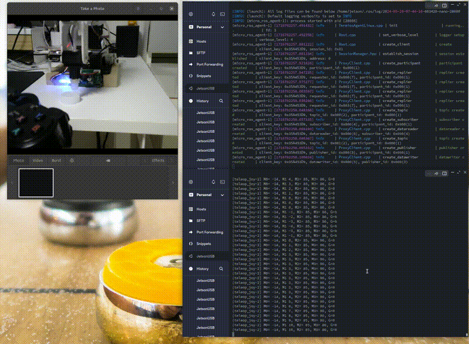

# Moniarm

## DIY RobotArm with ROS Galactic + Donkeycar!!   
This project is about ROS Package for Robot Arm with DIY robot     
Robot 3D model, BOM: Byungki    
  Byungki: rosaicbg@gmail.com   
Circuit: Byungki, ZETA7  
  ZETA7: zeta0707@gmail.com   
ROS code: ZETA7

# Especially Thanks
SooYong: https://github.com/Road-Balance/donkey_ros  
Other Open Source sites 

<p align="center">
    
    
    
    
    
    
</p>

There's Notion Lecture Notes and Youtube video's about this project.  
But, It's written in Korean. Anyway, Here's the link

* [Notion Lecture Notes] https://www.notion.so/zeta7/MoniArm-f29941635dfb4ff29d528842d2d5c38e   


## Tested System information

**Jetson Nano 2GB + USB camera**

* Ubuntu 20.04
* ROS Galactic
* Opencv3.4.6

## Packages with Brief Explanation

```
├── moniarm_camera => Handling Image data for USB camera 
├── moniarm_control => Control DIY Arm via ESP32 Herkulex  
├── moniarm_cv => Computer Vision Package  
├── moniarm_joy => Control DIY Arm with Gamepad 
├── moniarm_description => Control RC Car with Gamepad 
├── moniarm_moveit => Control RC Car with Gamepad 
├── Images
├── Doc
├── LICENSE
├── README.md
(...)
```

## Prerequisite

1. ROS Packages installation
   
```bash
$ sudo apt-get install ros-melodic-cv-bridge
$ sudo apt-get install ros-melodic-image-view
```

2. Clone this Repo

```bash
$ cd ~/ros2_ws/src
$ git clone https://github.com/orocapangyo/moniarm

$ cd ../
$ ros2_ws
$ source devel/setup.bash
```

### **1. joy_control**

Control RobotArm with game controller

<p align="center">
    
</p>

```bash
# Jetson
$ ros2 run moniarm_control joy_control.py

# Laptop or Jetson
$ ros2 launch moniarm_joy joy_teleop_axes.launch
```

### **2. keyboard_control**

Control RobotArm with keyboard

<p align="center">
    
</p>

```bash
# Jetson
$ roscore

# Jetson
$ ros2 run teleop_twist_keyboard teleop_twist_keyboard.py

# Laptop or Jetson
$ ros2 launch moniarm_joy joy_teleop_axes.launch

j l: 로봇암 좌우
i , : motor0 기울어짐
o . : motor2,3 기울어짐
u m : gripper 회전
t b: gripper 열림, 닫힘
```

### **3. Blob pick and plance**

Find the any color box of the Jetson Nano on the screen. then pick it then place

<p align="center">
    
</p>


```bash
$ ros2 launch moniarm_control blob_control.launch
```

Debugging with `image_view`

```bash
ros2 run image_view image_view image:=/webcam_image
ros2 run image_view image_view image:=/blob/image_mask
ros2 run image_view image_view image:=/blob/image_blob
```

### **4. Yolo pick and place**

Find the object of the Jetson Nano on the screen, pick it then place


<p align="center">
    
</p>


```bash
#terminal #1, #object detect using Yolo_v4
zeta@zeta-nano:~/ros2_ws$ ros2 launch darknet_ros yolo_v4.launch

#terminal #2
zeta@zeta-nano:~/ros2_ws$ ros2 launch moniarm_control yolo_chase.launch
```

### **5. Moveit state publisher**

moveit planner -> Move robot arm accordingly

<p align="center">
    
</p>

```bash
#terminal #1, Jetson
jetson@jp4512G:~/ros2_ws$ ros2 launch moniarm_control chase_moveit.launch

#terminal #2, Laptop
zeta@changwhan-ASUS:~/ros2_ws$ ros2 launch moniarm_description moniarm.launch
```

### **6. Moveit planner**

joint_states publisher -> Move robot arm accordingly  

<p align="center">
    
</p>

```bash
#terminal #1, Jetson
jetson@jp4512G:~/ros2_ws$ ros2 launch moniarm_control chase_moveit.launch

#terminal #2, Laptop
zeta@changwhan-ASUS:~/ros2_ws$ ros2 launch moniarm_moveit demo.launch
```
